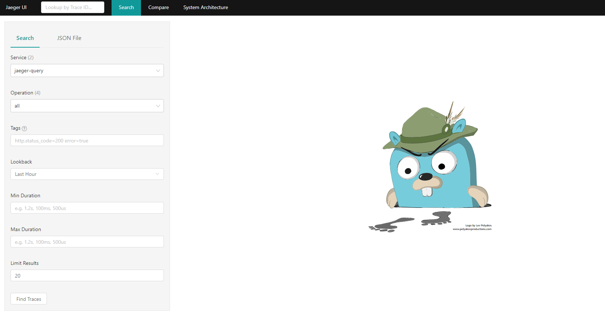
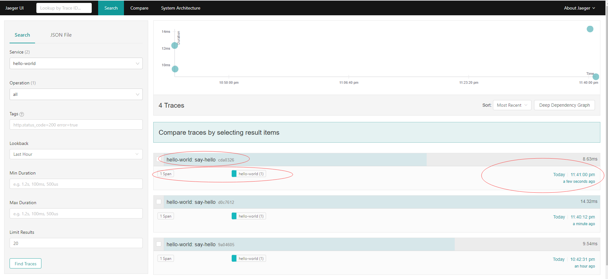
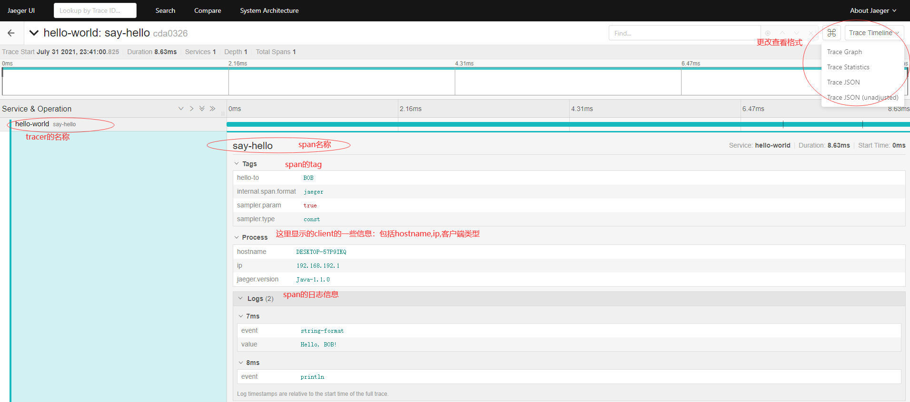
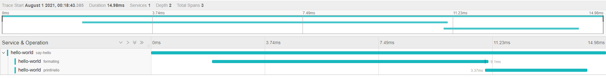
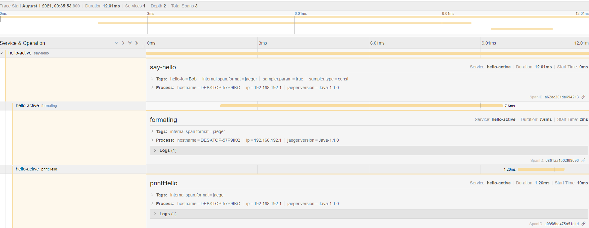
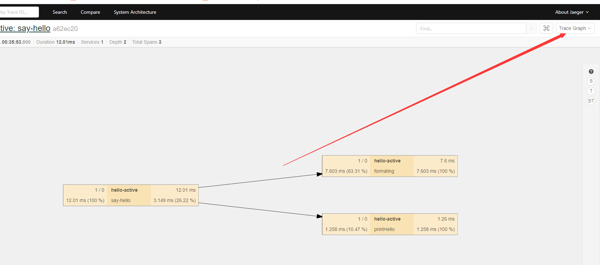

# Jaeger的案例讲解

##　jaeger-all in one

为了方便起见，本次直接拉去一个jaeger的全家桶all-in-one在测试环境：

```shell
 docker run -d --name jaeger \
  -e COLLECTOR_ZIPKIN_HTTP_PORT=9411 \
  -p 5775:5775/udp \
  -p 6831:6831/udp \
  -p 6832:6832/udp \
  -p 5778:5778 \
  -p 16686:16686 \
  -p 14268:14268 \
  -p 14250:14250 \
  -p 9411:9411 \
  jaegertracing/all-in-one:1.19
```

执行完命令后，all-in-one如果能正确的运行起来，我们可以查看jaeger的ui:

http://192.168.192.100:16686/search   Ip是安装all-in-one的主机ip



可以通过`http://192.168.192.100:14268/api/traces`来进行采样数据的传播

## jaeger Client-java讲解

这部分内容，主要分成4个层次来进行递进讲解，首先我们在pom.xml文件中增加依赖：

```xml
<properties>
        <project.build.sourceEncoding>UTF-8</project.build.sourceEncoding>
        <maven.compiler.source>1.8</maven.compiler.source>
        <maven.compiler.target>1.8</maven.compiler.target>

        <jaeger.version>1.1.0</jaeger.version>
        <guava.version>23.0</guava.version>
        <dropwizard.version>1.1.4</dropwizard.version>
        <okhttp.version>3.9.0</okhttp.version>
        <logback.version>1.2.1</logback.version>
    </properties>

    <dependencies>
        <dependency>
            <groupId>io.jaegertracing</groupId>
            <artifactId>jaeger-client</artifactId>
            <version>${jaeger.version}</version>
        </dependency>
        <dependency>
            <groupId>com.google.guava</groupId>
            <artifactId>guava</artifactId>
            <version>${guava.version}</version>
        </dependency>
        <dependency>
            <groupId>io.dropwizard</groupId>
            <artifactId>dropwizard-core</artifactId>
            <version>${dropwizard.version}</version>
        </dependency>
        <dependency>
            <groupId>com.squareup.okhttp3</groupId>
            <artifactId>okhttp</artifactId>
            <version>${okhttp.version}</version>
        </dependency>
        <dependency>
            <groupId>ch.qos.logback</groupId>
            <artifactId>logback-classic</artifactId>
            <version>${logback.version}</version>
        </dependency>
    </dependencies>
```

### lesson1  Hello World

1. 首先编写一个工具类，用来初始化一个tracer

   ```java
   import io.jaegertracing.Configuration;
   import io.jaegertracing.Configuration.SenderConfiguration;
   import io.jaegertracing.Configuration.ReporterConfiguration;
   import io.jaegertracing.Configuration.SamplerConfiguration;
   
   import io.jaegertracing.internal.JaegerTracer;
   import io.jaegertracing.internal.samplers.ConstSampler;
   
   public final class Tracing {
   
       private Tracing() {
       }
   
       private static final String endPoint = "http://192.168.192.100:14268/api/traces";
   
       public static JaegerTracer init(String service) {
   
           // jaeger ui: http://192.168.192.100:16686/search
           // jaeger controller: http://192.168.192.100:14268/api/traces
           SamplerConfiguration samplerConfiguration = SamplerConfiguration.fromEnv().withType(ConstSampler.TYPE).withParam(1);
   
           SenderConfiguration senderConfiguration = SenderConfiguration.fromEnv().withEndpoint(endPoint);
           ReporterConfiguration reporterConfiguration = ReporterConfiguration.fromEnv().withSender(senderConfiguration).withLogSpans(true);
   
           Configuration configuration = new Configuration(service).withSampler(samplerConfiguration).withReporter(reporterConfiguration);
   
           return configuration.getTracer();
       }
   
   }
   ```

2. 接着编写一个动作类：

   ```java
   import com.google.common.collect.ImmutableMap;
   import com.mylearn.jaeger.utils.Tracing;
   import io.jaegertracing.internal.JaegerTracer;
   import io.opentracing.Span;
   import io.opentracing.Tracer;
   
   public class Hello {
   
       private final Tracer tracer;
   
       private Hello(Tracer tracer) {
           this.tracer = tracer;
       }
   
       private void sayHello(String helloTo) {
           // 在方法的入口处初始化一个span,并打上标签
           Span span = tracer.buildSpan("say-hello").start();
           span.setTag("hello-to", helloTo);
   
           // 每执行一个小动作,就记上日志
           String helloStr = String.format("Hello, %s!", helloTo);
           span.log(ImmutableMap.of("event", "string-format", "value", helloStr));
   
           // 记录日志
           System.out.println(helloStr);
           span.log(ImmutableMap.of("event", "println"));
   
           // 执行完成后,调用finish方法
           span.finish();
       }
   
       public static void main(String[] args) {
   
           String helloTo = "BOB";
           // 初始化一个tracer并执行动作
           try (JaegerTracer tracer = Tracing.init("hello-world")) {
               new Hello(tracer).sayHello(helloTo);
           }
       }
   }
   ```

3. 执行代码，获取结果：

   ```java
   23:41:00.321 [main] DEBUG io.jaegertracing.thrift.internal.senders.ThriftSenderFactory - Using the HTTP Sender to send spans directly to the endpoint.
   23:41:00.806 [main] DEBUG io.jaegertracing.internal.senders.SenderResolver - Using sender HttpSender()
   23:41:00.821 [main] INFO io.jaegertracing.Configuration - Initialized tracer=JaegerTracer(version=Java-1.1.0, serviceName=hello-world, reporter=CompositeReporter(reporters=[RemoteReporter(sender=HttpSender(), closeEnqueueTimeout=1000), LoggingReporter(logger=Logger[io.jaegertracing.internal.reporters.LoggingReporter])]), sampler=ConstSampler(decision=true, tags={sampler.type=const, sampler.param=true}), tags={hostname=DESKTOP-57P9IKQ, jaeger.version=Java-1.1.0, ip=192.168.192.1}, zipkinSharedRpcSpan=false, expandExceptionLogs=false, useTraceId128Bit=false)
   Hello, BOB!
   23:41:00.834 [main] INFO io.jaegertracing.internal.reporters.LoggingReporter - Span reported: cda0326b3bc8020c:cda0326b3bc8020c:0:1 - say-hello
   ```

   同时，在页面上我们也能看到结果：可以可看到tracer的service名字, Span的名字，相关的时间等信息

   

我们点进去可以获取进一步的详细信息：



到这一步，我们可以看到jaeger完全充当了一个日志记录的作用，好像没什么大的用处，无法是能显示的好看一点而已。我们接着往下走...

### lesson2 Context and Tracing Functions

刚上一节，我们已经试验了在单个tracer中单个span的案例，本节我们接着练习感受下，如何在同一个tracer中使用多个span来trace。

```java
import com.google.common.collect.ImmutableMap;
import com.mylearn.jaeger.utils.Tracing;
import io.jaegertracing.internal.JaegerTracer;
import io.opentracing.Span;
import io.opentracing.Tracer;

public class HelloManual {

    private Tracer tracer;

    private HelloManual(Tracer tracer) {
        this.tracer = tracer;
    }

    private String formatString(Span rootSpan, String helloTo){
        // 创建一个新的span，并作为rootSpan的孩子
        Span span =tracer.buildSpan("formating").asChildOf(rootSpan).start();

        try{
            String helloStr = String.format("Hello,%s!",helloTo);
            span.log(ImmutableMap.of("event","string-format","value",helloStr));
            return helloStr;
        }finally {
            span.finish();
        }
    }

    private void printHello(Span rootSpan,String helloStr){
        // 创建一个新的span，并作为rootSpan的孩子
        Span span = tracer.buildSpan("printHello").asChildOf(rootSpan).start();
        try {
            System.out.println(helloStr);
            span.log(ImmutableMap.of("event","println"));
        }finally {
            span.finish();
        }
    }


    private void sayHello(String helloTo){
        // 创建一个span
        Span span =tracer.buildSpan("say-hello").start();
        span.setTag("hello-to",helloTo);

        // 调用formatString方法，并把span传入
        String helloStr = formatString(span,helloTo);
        // 调用printHello方法，并把span传入
        printHello(span,helloStr);

        // 调用finish方法
        span.finish();
    }

    public static void main(String[] args) {
        // 创建一个tracer, tracer的service命名为hello-world
        try (JaegerTracer tracer = Tracing.init("hello-world")){
            new HelloManual(tracer).sayHello("Bob");
        }
    }
}
```

如下图所示，这是HelloManual运行后在UI查到的结果，可以明确看到有3个span,它们都是在tracer(hello-world)下，其中父span是say-hello, 子span有两个分别是formating和print-hello



与HelloManual不同的方法，我们还可以使用scopeManager来管理Span的父子关系：

```java
import com.google.common.collect.ImmutableMap;
import com.mylearn.jaeger.utils.Tracing;
import io.jaegertracing.internal.JaegerTracer;
import io.opentracing.Scope;
import io.opentracing.Span;
import io.opentracing.Tracer;

public class HelloActive {
    private Tracer tracer;

    private HelloActive(Tracer tracer) {
        this.tracer = tracer;
    }

    private String formatString(String helloTo){
        // 创建一个新的span，并作为rootSpan的孩子
        Span span = tracer.buildSpan("formating").start();
        try(Scope scope = tracer.scopeManager().activate(span)){
            String helloStr = String.format("Hello,%s!",helloTo);
            span.log(ImmutableMap.of("event","string-format","value",helloStr));
            return helloStr;
        }finally {
            span.finish();
        }
    }

    private void printHello(String helloStr){
        // 创建一个新的span，并作为rootSpan的孩子
        Span span = tracer.buildSpan("printHello").start();
        try (Scope scope = tracer.scopeManager().activate(span)){
            System.out.println(helloStr);
            span.log(ImmutableMap.of("event","println"));
        }finally {
            span.finish();
        }
    }


    private void sayHello(String helloTo){
        // 创建一个span
        Span span =tracer.buildSpan("say-hello").start();
        try (Scope scope = tracer.scopeManager().activate(span)){
            span.setTag("hello-to",helloTo);

            // 调用formatString方法，并把span传入
            String helloStr = formatString(helloTo);
            // 调用printHello方法，并把span传入
            printHello(helloStr);
        }finally {
            // 调用finish方法
            span.finish();
        }
    }

    public static void main(String[] args) {
        // 创建一个tracer, tracer的service命名为hello-world
        try (JaegerTracer tracer = Tracing.init("hello-active")){
            new HelloActive(tracer).sayHello("Bob");
        }
    }

}
```

运行后查看UI，得到的结果与HelloManual是一样的，不再细说：



还可以以图的形式查看调用关系：



